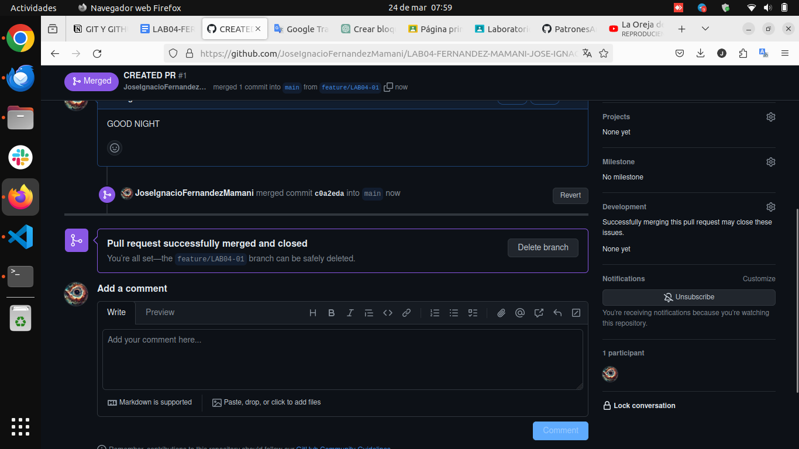

# LAB04
## Q2 npm init
inicializacion de un proyecto de node.js, de que forma ? -> creando un archivo
package.json que contiene metadatos(informacion que describe el proyecto)
configuraciones -> parametros que determinan el comportamiento del proyecto
dependencias -> recursos necesarios para que una apliacion funcione correctamente
## Q3
## —¿Cómo es que se instalan paquetes con yarn?
```csharp
yarn add package
```

## —¿Cómo es que se borran paquetes con yarn?
```csharp
yarn remove package
```

## —¿Hay algún equivalente en yarn que haga lo mismo que npm init?
```csharp
yarn init
```

## —¿Cómo elimino una rama creada en git? Crea una nueva rama llamada feature/QA, para posteriormente borrarla.

```bash
    git branch feature/QA
    git branch -d feature/QA
```


## —¿Por qué debería de usar la ramificación en proyectos?
Realizar esta practica nos trae una serie de beneficios; Aislamiento de cambios, Facilita la colaboración, Pruebas aisladas, Seguimiento de cambios, Mantenimiento del código base estable


## —Usted recibió un ticket [SEM-005] y una vez terminado el trabajo usted decide crear una rama para un posterior PR. ¿Qué nombre pondría a la rama al momento de crearla?
feature/SEM-005



